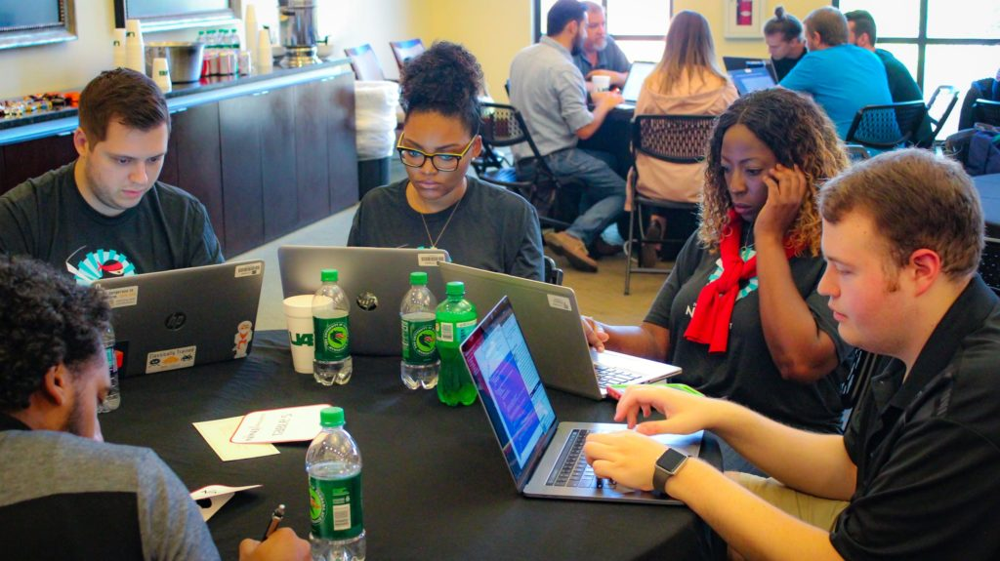

# SIAM-FM21 Programming Challenge Sponsored by MathWorks

  
   
  

# Introduction

Welcome to the first SIAM FM Programming Challenge sponsored by MathWorks! The main focus of quantitative and data science roles in the finance industry today is to implement research in a real-world context. Student teams, composed of undergraduate and graduates from any activity areas of SIAM, shall partake in a two month programming challenge to solve a mathematical programming problem arising in financial modeling using state-of-the-art computational techniques implemented in Matlab. Winning teams shall be awarded cash prizes at a FM21 award ceremony which shall take place either virtually or in hybrid mode between June 1st-4th in Philadelphia. Please take note of the important deadlines below and ensure that your team is registered by 11:59pm EST, January 31st, 2021. 

# Competition Rules 

Teams shall consist of up to 3 members with a minimum of two. Teams can be composed of actively enrolled undergraduate and graduate students from all disciplines of applied mathematics and computational science and engineering. We strongly encourage multi-disciplinary teams. By enrolling in the challenge, at least one member of your team must attend the conference if invited. We shall invite the top 3 teams to present. 

The programming challenge has been structured to encourage wide engagement across the student community, providing participant teams the necessary bandwidth to apply various methodologies known across the quant industry and the research community to the same problem. Solutions shall consist of both MATLAB code submissions in addition to a short written report describing the solution. Each team submission shall be scored according the following rubric: up to 40% shall be awarded for performance of the team’s solution on test data, up to 40% shall be awarded for novelty of the solution, and up to 20% shall be awarded for clarity of the solution approach as evidenced by the quality of the report and the submitted code.

MathWorks, makers of MATLAB and Simulink, is offering participating teams complimentary software, tutorials, and videos.
Find out more about how technical computing and Model-Based Design can help you compete:
https://www.mathworks.com/academia/student-competitions/siam-financial-mathematics-and-engineering-student-programming-competition.html

# Prizes

The winning team shall receive $500, and teams in second and third place shall respectively receive $300 and $200. Each invited team shall be reimbursed for travel expenses by an amount not to exceed $660. The team can decide how best to split the travel reimbursement among their members. For instance they can delegate one member to attend and present who will be assisted with $660, or have three members attend the conference, each assisted with $220). 

# Important Dates 

- 11:00am EST, January 25th: Q&A webinar with the SIAM FM21 programming challenge committee (details sent via Slack). 
- 11:59pm EST, January 31st: Team registration deadline closes.
- 11:59pm EST, March 31st: Submission deadline.
- 5:00pm EST, April the 16th: Selection of finalist teams. 

# Programming Challenge Instructions

The programming challenge shall consist of optimizing a portfolio of stocks by constructing a trading strategy which uses historical stock prices. You shall use a market simulator provided to you to generate the stock price history with market impact. The specification of the problem together with the modeling and documentation requirements are provided [!here](ProblemDescription.PDF).  See [!example MATLAB code](MarketSimulatorExample.m) for an example of how to use it.  Note that the values of the parameters in the market simulator have been preset by the programming challenge committee but you are free to change them.

At the end of the competition, each team shall submit their code and report to the programming challenge committee by the April 31st deadline. The team must provide an additional test function, in a file test.m, which shall take as an argument a market_simulator object, use the optimal set of weights (found during training) and return the evaluated maximized utility function:

function utility= test(market_simulator)
    ... 
    utility=...
end
It is important to clarify that the test function should not perform any optimization. Note also that the program challenge committee shall modify the parameters of the market simulator for testing purposes and run each team’s test function with several new market simulator objects to obtain the maximized utilty function. Each team shall be ranked by their aggregate utility function values across the test cases and assigned up to 40% of the overall competition score. Further details of where to submit your team solution shall be added here later.

# Registration 

Please register your team [!here] for the deadline of January 31st. In the unlikely event that the team changes after the registration deadline, please contact the programming challenge committee for approval. Teams that do not register their team by the deadline or change their team members without approval shall be disqualified from the competition.

# Slack Channel Updates

From time to time, the committee shall make announcements and provide additional clarification through the slack channel: . You are strongly encouraged to subscribe to the channel, post questions and stay abreadst of the latest updates. You can download the slack app for your smartphone or desktop at no cost. This webpage shall also be periodically updated and you should check the latest version of the webpage before submitting your solution. 

# Contact Information

The SIAM FM21 Programming Challenge Committee consists of academics and practitioners:

- Matthew Dixon, Assistant Professor, Department of Applied Math, Illinois Tech. Email: matthew [dot] dixon [at] iit [dot] edu (Chair)
- Stuart Kozola, Head of Product Management and Strategy - Quantitative Finance, MathWorks. Email: skozola [at] mathworks [dot] com
- Philippe Casgrain, Postdoctoral Researcher, Seminar for Applied Math, ETH Zurich. Email: philippe [dot] casgrain [at] math [dot] ethz [dot] ch

